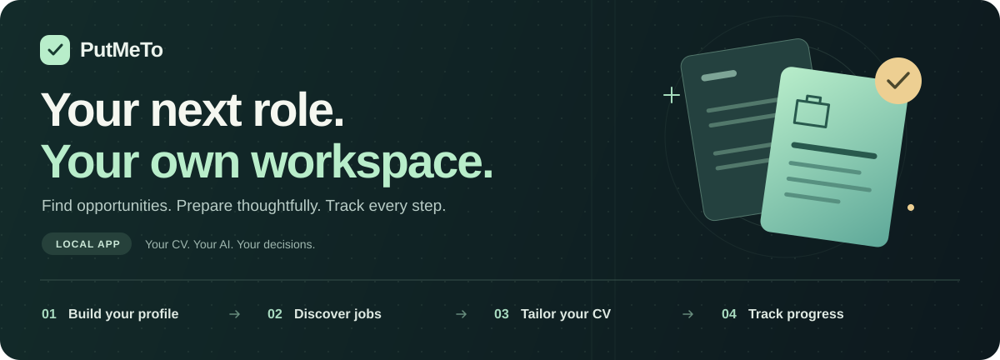

# PutMeTo



<p align="center">
  <strong>A personal AI workspace for your next career move.</strong><br>
  Automate the preparation. Personalize the search. Keep the final say.
</p>

<p align="center">
  <a href="#features">Features</a> ·
  <a href="#start-the-application">Quickstart</a> ·
  <a href="#choose-your-ai">AI options</a> ·
  <a href="#build-your-own-agent">Custom agents</a> ·
  <a href="#documentation">Documentation</a>
</p>

---

**No API key required with Codex and your ChatGPT sign-in. No AI subscription required with local Ollama.**

PutMeTo brings your CV, job search, tailored resumes, and application tracker into one web app on your computer. There is no PutMeTo account or subscription. Use the Codex access in your existing ChatGPT subscription, or run CV processing with a local model.

Your workspace and browser automation run locally. With local Ollama, CV processing stays on your computer too. Codex sends AI requests to OpenAI; job searches and applications contact the relevant job websites.

## Features

| | What you can do |
| --- | --- |
| **📄 Your CV, ready to work** | Import your CV as a PDF. The AI reads each page, your own wording is kept, and extracted information is accepted automatically; edit anything whenever you want. |
| **🔎 A search shaped around you** | Choose target roles, locations, and sources. Discover opportunities through LinkedIn, Remotive, Greenhouse, Lever, and supported careers pages. |
| **✨ A resume for each opportunity** | Prepare tailored resumes from confirmed experience and skills. Preview, print, or download a PDF. |
| **📊 Application tracking & progress reports** | See saved jobs, tailored resumes, in-progress applications, and confirmed submissions in dashboard summaries. |
| **🤖 A workspace for your agents** | Use the built-in Codex assistant, or connect your own agent through the Python client and local API. Build custom search, filtering, and summary workflows. |
| **🚀 Apply automatically** | Let a browser agent submit applications for jobs that match your master CV at 70% or more, using only your data. It stops to ask you rather than guess. |
| **🏡 Automation on your computer** | Run the app, database, and assisted browser locally. Review suggested content and application forms before submitting. |

## From your CV to your next application

**Import → Edit if needed → Discover → Tailor → Apply → Track**

1. **Bring your experience.** Import your CV. Your profile, experience, and skills are accepted automatically; edit them anytime.
2. **Set your direction.** Choose roles, locations, and job sources.
3. **Find your shortlist.** Discover jobs and save opportunities worth pursuing.
4. **Prepare your application.** Generate a tailored resume and review it.
5. **Keep moving.** Open the application, review the browser's suggested answers, submit on the employer's site, and mark it submitted in PutMeTo.

### See your progress at a glance

The **Overview** and **Applications** pages provide a live progress report: discovered jobs, saved opportunities, tailored resumes, and applications in progress or submitted. Application records keep the job, employer, start date, status, and any recorded note together.

These reports reflect your saved workspace and confirmed actions. Opening an application does not count as submitting it.

## Start the application

You need **Python 3.11+** and a web browser. Download or clone this repository, then run these commands from its directory.

<details open>
<summary><strong>macOS / Linux</strong></summary>

```bash
python3 -m venv .venv
source .venv/bin/activate
python -m pip install -r requirements.txt
python run.py
```

</details>

<details>
<summary><strong>Windows PowerShell</strong></summary>

```powershell
py -3.11 -m venv .venv
.\.venv\Scripts\Activate.ps1
python -m pip install -r requirements.txt
python run.py
```

</details>

On macOS or Linux you can also run it in the background: `./putmeto.sh start`, and later `./putmeto.sh stop`, `restart`, `status`, or `logs`. Stopping works like Ctrl+C, so the LinkedIn browser closes cleanly and keeps your sign-in; the log is `data/putmeto.log`.

Open **[localhost:8000](http://127.0.0.1:8000)**. New workspaces use the local Codex CLI by default; open **Assistant** to check your ChatGPT sign-in, then import your CV. You can choose another AI provider in **Settings**. Keep the terminal running; press **Ctrl+C** to stop.

No Node.js installation, frontend build, or hosted database is needed.

## Choose your AI

| | Codex + ChatGPT | Local Ollama | Compatible API |
| --- | --- | --- | --- |
| **API key** | Not required | Not required | Depends on the provider |
| **Account / subscription** | ChatGPT account with Codex access; your plan's limits apply | No AI account or subscription for local models | Depends on the provider |
| **AI processing** | OpenAI, through the Codex CLI running locally | On your computer with a downloaded model | At your configured endpoint |
| **CV extraction, suggestions & tailoring** | Yes | Yes | Yes |
| **Built-in Assistant chat** | Yes | Uses Codex separately | Uses Codex separately |

### Use your ChatGPT subscription

Choose **Codex — sign in with ChatGPT** in Settings, then open **Assistant**. PutMeTo runs the official Codex CLI locally and can reuse an existing Codex ChatGPT sign-in. If needed, sign in from the app. The project includes the Codex runtime during installation.

No separate OpenAI API key is needed for this route. [ChatGPT sign-in uses subscription access](https://learn.chatgpt.com/docs/auth), subject to account permissions and usage limits.

### Use local AI with no subscription

[Install Ollama](https://ollama.com/download), download a model, and keep Ollama running:

```bash
ollama pull llama3.2
```

In **Settings**, choose **Ollama**, set the URL to `http://127.0.0.1:11434`, and enter `llama3.2` as the model. Select **Test connection**. You can use another installed model that supports structured JSON output.

For local processing, use a downloaded model and a local endpoint. Ollama also supports cloud models, so the model choice matters. [Ollama's local-processing guidance](https://docs.ollama.com/faq#does-ollama-send-my-prompts-and-answers-back-to-ollamacom) explains the distinction. Full setup: [AI configuration](docs/user-guide.md#configure-ai).

## Build your own agent

Make PutMeTo fit the way you search. The local API and `LinkedInAgent` Python client expose discoverable tools for searching, reading job pages, maintaining reusable searches, and reviewing application fields.

Your agent can choose its next action from those tools, ask you for missing information, and turn the results into a personalized shortlist or summary. You choose the prompts, filtering rules, and model in your own code.

For example, with PutMeTo running, read saved LinkedIn jobs into your own workflow:

```python
from linkedin_agent import LinkedInAgent

workspace = LinkedInAgent()
jobs = workspace.saved_jobs(query="your target role", limit=20)

for job in jobs["items"]:
    print(job["title"], job["company"], job["status"])
```

This example reads locally saved jobs. Use `workspace.tools()` to discover the tool schemas, or the saved-search methods to collect new results through the managed browser.

**Agent customization is code-based today.** The built-in chat uses Codex and a defined set of application tools; your own agent can use a different runtime or a local model. Login, verification, and final submission remain under your control.

[Build a personalized agent →](docs/custom-agents.md) · [Python, CLI & tool reference →](docs/linkedin-agent.md)

## Optional Camoufox browser

Enable LinkedIn search, supported careers-page discovery, and assisted application forms:

```bash
python -m pip install -r requirements-browser.txt
python -m camoufox fetch
```

Restart PutMeTo. Sign in to LinkedIn in the visible browser when prompted; its session is stored in your local workspace.

Searches return bounded batches. Browser assistance fills recognized fields and can attach your prepared resume; you review and submit. Site availability, verification, and rate limits still apply. [Browser setup](docs/user-guide.md#optional-camoufox-browser) · [LinkedIn search](docs/user-guide.md#search-linkedin)

## Optional auto-apply

Let [browser-use](https://github.com/browser-use/browser-use) fill in and submit applications in Chrome, driven by Codex through your ChatGPT sign-in:

```bash
python -m pip install -r requirements-apply.txt
```

Restart PutMeTo, fill in **Your answers for applications** on the Applications page, sign in to LinkedIn in the application browser, and select **Start**. [How auto-apply works](docs/user-guide.md#apply-automatically)

## Your data, on your computer

- **Stored locally:** your profile, confirmed content, jobs, applications, settings, and persistent LinkedIn browser session.
- **Processed locally with local Ollama:** CV extraction, rephrasing, skill suggestions, and resume tailoring.
- **Sent when needed:** searches and applications go to job websites; Codex or a remote AI provider receives the content needed for its AI requests.

The default workspace is `data/workspace.sqlite3`. Back up the entire `data/` directory with the app stopped. Its contents, browser sessions, CV files, and credentials are excluded from Git. The local database is not encrypted at rest.

The app binds to `127.0.0.1` and is designed for one person on their own computer. [Storage, backups & configuration →](docs/user-guide.md#local-data-and-backups)

## Documentation

| Guide | Inside |
| --- | --- |
| [User guide](docs/user-guide.md) | Full setup, CV workflow, AI options, job sources, browser setup, and troubleshooting |
| [Custom agents](docs/custom-agents.md) | Personalized shortlists, progress summaries, and reusable search workflows |
| [Agent API](docs/linkedin-agent.md) | Python client, CLI, tool schemas, and explicit form filling |
| [Codex integration](docs/codex.md) | Local runtime, ChatGPT sign-in, application tools, and approval flow |
| [Implementation](IMPLEMENTATION.md) | State model and API contracts |
| [Publishing safely](docs/publishing.md) | Keep personal data, credentials, and browser sessions out of public commits |

## Development

```bash
python -m pip install -r requirements-dev.txt
python -m pytest -q
python3 scripts/check_public_repo.py
```

Tests use synthetic data, temporary databases, and mocked AI/network calls. Optional browser checks and setup instructions are in the [user guide](docs/user-guide.md#development-and-verification).

To contribute, use synthetic fixtures, describe the behavior your change improves, and include the relevant checks. Review the [publication guidance](docs/publishing.md) before sharing data or screenshots.
